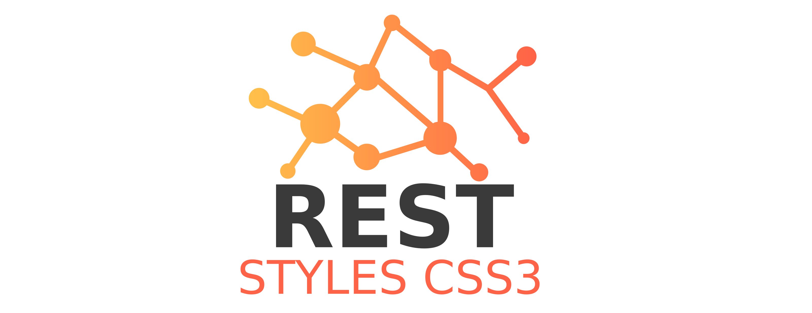

<p align="center">
    <a href="https://github.com/thalysonrodrigues/freestylesheets">
        
    </a>
</p>

REST API for consumption of styles and fonts in css3
====================================================

[](https://badge.fury.io/gh/thalysonrodrigues%2Ffreestylesheets)
[](https://github.com/thalysonrodrigues/rest-styles-css3/blob/master/LICENSE)

## Introduction

API with REST (Representational State Transfer) architecture patterns.

## Documentation

The documentation was built on the basis of the documentation standard for BluePrint APIs. See more about in https://apiblueprint.org/.
Documentation for this project is available from this repository at [`./docs/rest-css3-v*.apib`](https://github.com/thalysonrodrigues/freestylesheets/tree/master/docs). See also in [Github Pages](https://thalysonrodrigues.github.io/freestylesheets/) rendered by [aglio](https://github.com/danielgtaylor/aglio).

## View docs

Visit here in [Github Pages](https://thalysonrodrigues.github.io/freestylesheets/)

## Built with Zend

API built from the skeleton of the micro framework [Zend Expressive](https://docs.zendframework.com/zend-expressive/) in version `v3.0.1`, see more in `./api/composer.json`.

## Installation
```
## clone this project with git
$ git clone https://github.com/thalysonrodrigues/freestylesheets.git
```

### Docker

With Docker and docker-compose installed in your environment, run this command in folder root:

```
## create all containers this application
$ sudo docker-compose up
```

## Outputs

### The responses of this API may have the following formats

```
text/css
text/html (default)
application/json
application/xml
```

## Credits

- [Thalyson Alexandre Rodrigues de Sousa](https://github.com/thalysonrodrigues)

## License

The MIT License (MIT). Please see [License File](https://github.com/thalysonrodrigues/freestylesheets/blob/master/LICENSE) for more information.
